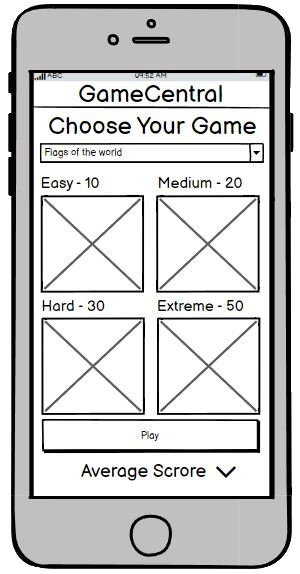
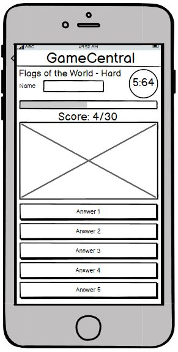
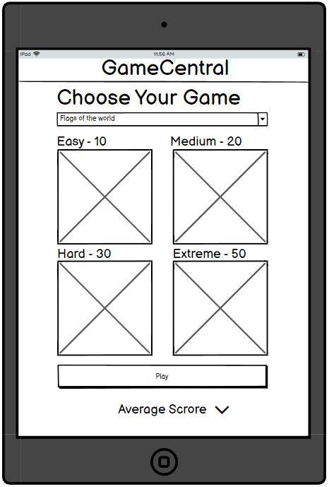
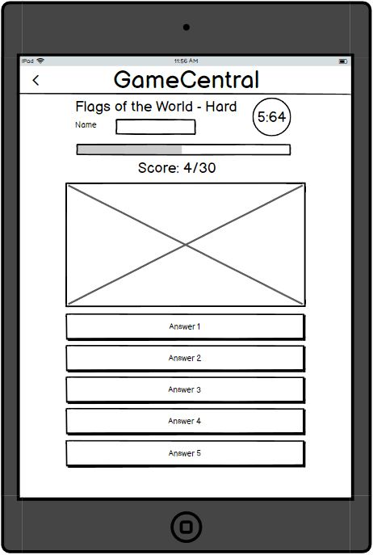
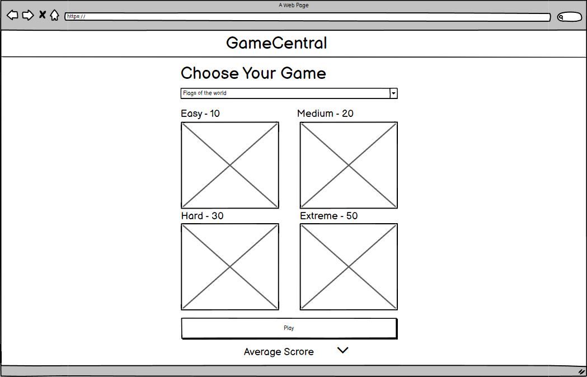
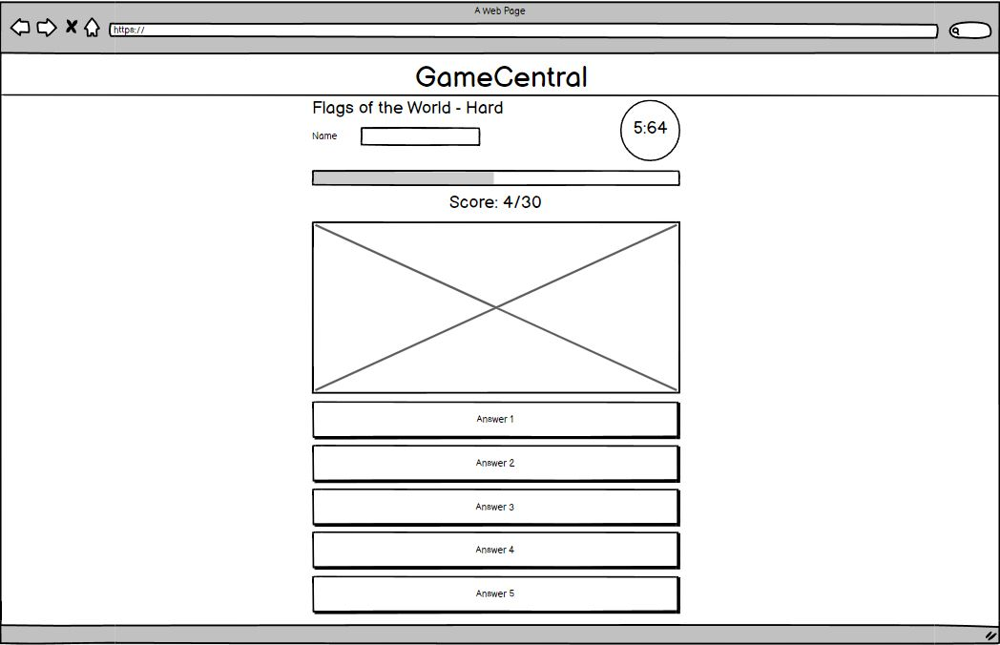

# Flags of the World

## Introduction
Flags of the world is a fun, interactive and educational game that aims to teach the user about flags from different countries around the globe. The game features difficulties suitable for all ages.

## Design

A simplistic game must have an easy to use UI. This ensures that the user can navigate the page effectively and quickly. Since this game is designed to be an educational tool, and potentially used by young children it is important to make it as simplistic as it can be.

Due to its nature, a simple game like this will most likely be used on a mobile platform, with this in mind the sensible decision is to optimise the website primarily for mobile use.

One of the future aspirations of this project is to be expanded to more games in the future. This may include other geographical games or other quizzes. Therefore there must be a suitable navigation menu if the user needs to navigate to other pages. This can be added as and when more content has been created.

Below are the initial concept designs for the project. They were created with Balsamiq wireframes.

## Features

* The user is also presented with four difficulty boxes to choose from. These range from easy to extreme. Based on the difficulty selection the time the user has to answer the questions and the number of questions will change.

* Once the user gets into a game the counter will start and they will be presented with a flag and five answers to choose from. If the user selects the correct answer the box will change colour and turn green, then the score will go up, indicating that the user got the correct answer. If the user got the answer wrong, the box will turn red, then the correct box will turn up green. The score tally will also not go up.

* To add a bit of pressure to the user, the game also features a timer. Once the timer gets to 0 then the game will automatically move to the next question. This makes it a lot harder to cheat if the user wanted to.

* Once the game is over an alert will pop up on the users' screen and will tell them their score. The user then has the choice to play again.

## Features to come

* A difficulty factor has been added to the array for future use. Each flag starts with a difficulty of 0.5. When a user gets the question correct, the difficulty value will be multiplied by 99% then that value will become the new difficulty value. If a user gets a question wrong the opposite will happen, the value will be multiplied by 101% and that will become the new value. After some time the difficulties will become scattered. This is when a selection rule can be created, taking the lower scoring flags for the easy difficulty and the higher scoring flags for the harder difficulties.

* A relatively simple update to the game will be the inclusion of a name field. This will be where the user can input their name so that the scores that they get can be personalised with their name.

* Once the name feature has been included, a leaderboard can be added at the bottom of the page. This would be separated into the difficulties and record the best scores that people have gotten.

* As well as leaderboards previous history could also be added. For example, if a user hovers over a difficulty, a chart could become visible displaying the previous scores the last users received.

* One essential update, later on, will be the obfuscation of data. This is important as it will stop the user from looking up the results in the console and keep the results fair. This is especially important in the educational field.

* The website can also be expanded at a later date to include some other games. A hamburger menu could be created (Space was left in the corners for this purpose). A couple of games that could be added could be:
    * Local flags (eg state flags)
    * Guess the country by outline.
    * Guess the country on the map.

## Testing

* In the initial testing 4 participants were selected, the response was positive. However, they had a couple of suggestions, they didn't like the two-stage click on the difficulty so the second click was removed. They also did not like all the boxes turning red when they were wrong. They requested more distinction between their selected answer and the correct one.

* In user testing I selected two participants to trial the game whilst it was in its development stage. I observed the user as they played the game. I noticed that the timer frequently ran out whilst they were playing, the timer didn't have any effect on the game at this point but it was worth noting that 8 seconds is not long enough for self-proclaimed novices

* In the final user testing a couple of issues were highlighted. The users were not a fan of the alert that appeared on the screen. They found it "Ugly" and "Not pleasant to look at". This alert was then replaced with a popup menu that gave the user the option to play again. This change was welcomed when I presented it back to the testers.

* web.dev
* html validator
* css validator

## Bugs / Optemisations

* There is a chance that an answer can be repeated in the 'userChoice' section. The odds of an answer being repeated is 1/62,500 per question. If the user chose the extreme mode there is a 1/1,250 chance that the answer could reappear. There is also a chance that there could be 3, 4 or 5 answers repeated. However, those odds are unimaginably small so they are not of concern (1/15million,1/4 billion, 1/1 trillion respectively).

* There is an issue with event listeners and the validation function. Currently, the event listener is copied down and an index value is set, this is used in the validation function to differentiate between the user choice. I attempted to add the event listener into a for loop to avoid the same lines being repeated. Whenever that change is made, the selection of 'userChoice' breaks and doesn't work how it is intended. As it works at the moment this can be categorised as optimisation and can be completed at a later date.

* A minor bug is at the end of the game. When the popup menu opens, the user can continue to click the answers and they will turn either red or green depending on whether the user got the answer correct. This error does not affect the game in any capacity so it isn't essential to fix it.

## Notes

# Remember
* Variable names
* Information Architecture
* Splash page required
* Accessibility
* Usage of web standards
* 'linter' gitpod
* program defensively

## Credits

Flags were taken from https://www.worldometers.info/geography/flags-of-the-world/